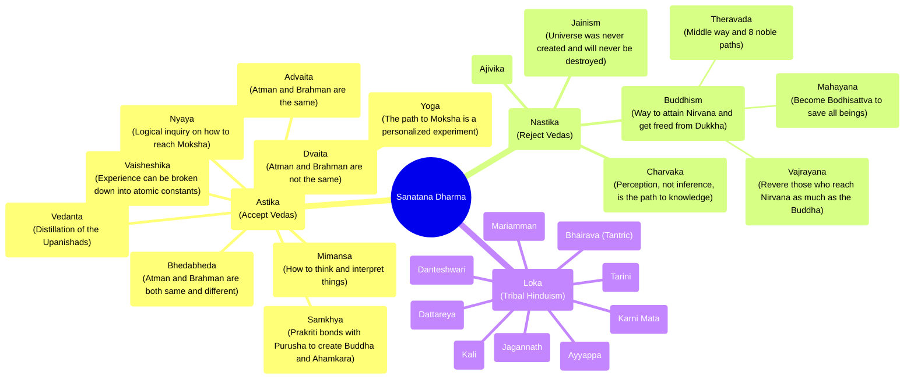

school of thought in philosophy

# School of thoughts in Vedic philosophy (Indian philosophy)
##Āstika schools
The six most studied schools of Indian philosophy in vedic religion, also known as the **orthodox** schools, are: 
1. **Nyāya**: Focuses on logic and the belief that logical reasoning is the key to salvation. logic and justice as the core founded by* Gotama/Aksapads* — with center as the ancient Mithila university.
2. **Vaiśeṣika**: Focuses on atomic theory and is considered a realistic and objective philosophy of the universe. atomist school with naturism and metaphysics as stress. Founded *Kanada Kashyapa*. 
3. **Sāṃkhya**: Focuses on the analysis of matter and spirit. enumeration of 25 key principles that lead to emacipation founded by *Kapila*. Everything is an interplay of Purusha (soul) and Prakriti (energy).
4. **Yoga**: Focuses on self-realization through a combination of physical discipline, mental focus, and ethical living. the 8 fold path of Patanjali that start from *Yamas and Niyamas*. Control of body and mind to attain liberation.
5.**Mīmāṃsā  (Purva Mimasa):** Focuses on the science of furtive work. focuses on critical investigation of vedas, dharma founded by Jamini. Compared to Vedanta, it places more emphasis on rituals and yajnas.
6. **Vedānta (Uttara Mimasa)**: Focuses on the science of God realization.  empahsis on the upanishads, Brahma Sutras and Bhagvad Gita. Vyasa is the key sage for this. 

##Nāstika schools
The 5 religious schools that declined to believe in the supremacy of Veda. 2 of them became independent religions, while the philosophies of other 3 merged with other faiths. by contrast, are those who deny all the respective definitions of āstika;[5] they do not believe in the existence of Self.

The five major ** non-Vedic** or **heterodox** schools are: 
1. **Jain** 
2. **Buddhist** 
3. Ajivika 
4. Ajñana 
5. Charvaka 

## Loka
Folk traditions - these were faiths that are quite common across rural India and of indeterminant origin. This group is often left out in the discussion of Indian philosophies.
1. Karni Mata
2. Dattareya
3. Bhairava (Tantric)
4. Tarini
5. Ayyappa
6. Jagannath
7. Danteshwari
8. Mariamman
9. Kali

### Reference:
- [Āstika and nāstika Wiki](https://en.wikipedia.org/wiki/%C4%80stika_and_n%C4%81stika "Āstika and nāstika Wiki")
- [What are the various schools of thoughts within Hinduism?](https://www.quora.com/What-are-the-various-schools-of-thoughts-within-Hinduism "What are the various schools of thoughts within Hinduism?")
- **[Is Shankara the first Hindu fundamentalist..?](https://www.vedabhasya.org/2021/10/is-shankara-first-hindu-fundamentalist.html "Is Shankara the first Hindu fundamentalist..?")**
- [Vedic Schools - Chinnajeeyar.org](https://vedicschools.chinnajeeyar.org/ "Vedic Schools - Chinnajeeyar.org")

> Structure

